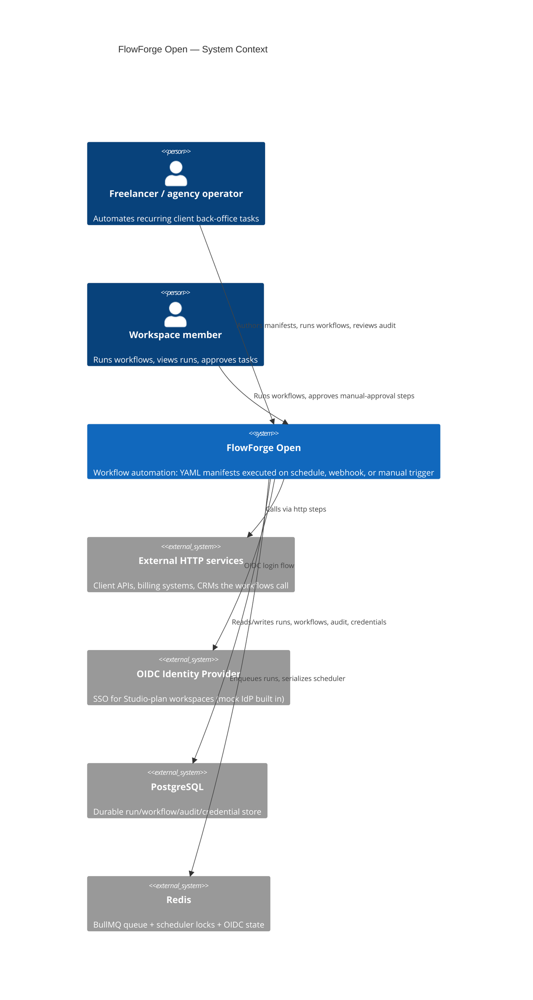
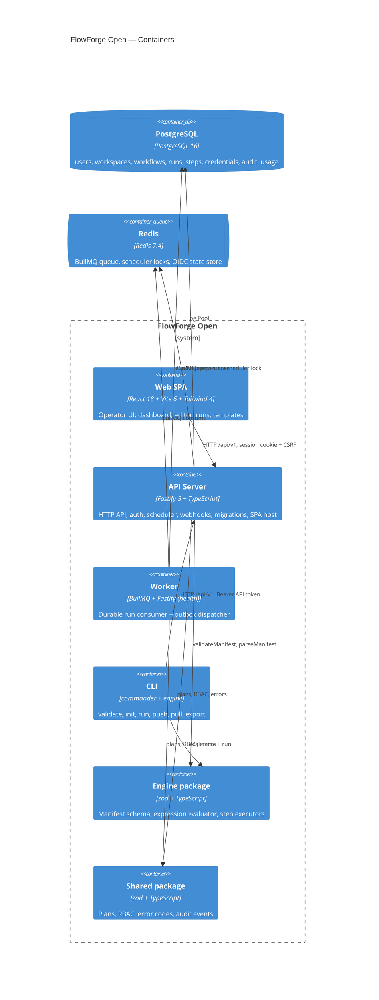
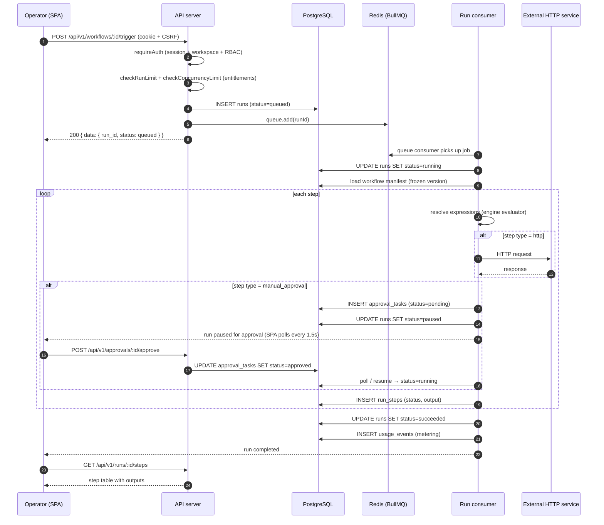
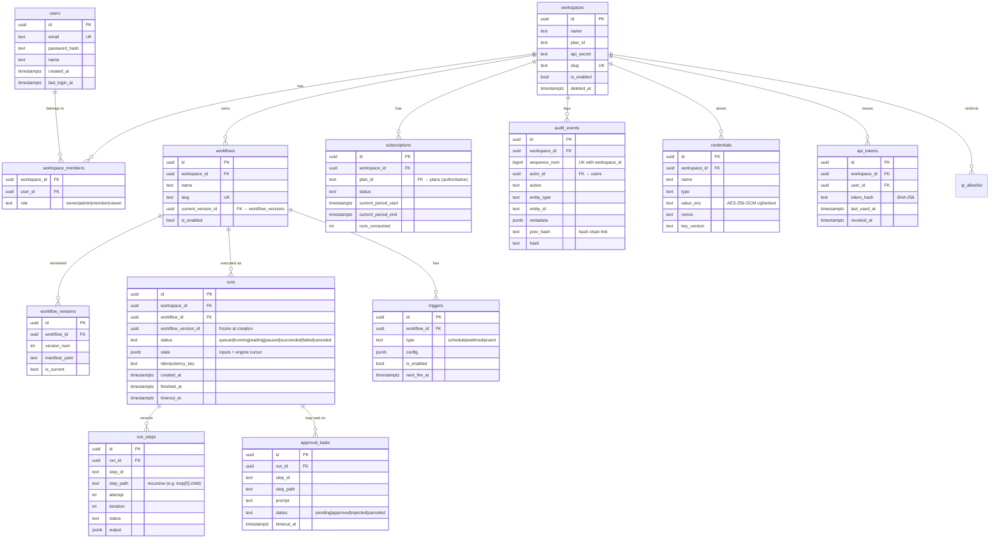

# FlowForge Open — Architecture

How the system fits together: components, data model, runtime topology, and the primary execution flow.

---

## Project shape

FlowForge Open is a **hybrid**: a Fastify HTTP API server, a React SPA, a CLI tool, and an optional standalone worker. The server is the canonical component — it hosts the API, serves the SPA, runs migrations, drives the scheduler tick, ingests webhooks, and (in embedded mode) runs the BullMQ consumer that executes workflows. The standalone worker is the horizontally-scalable deployment path for run execution.

| Component | Technology | Role |
|---|---|---|
| **API server** (`apps/server`) | Fastify 5, TypeScript, Postgres (`pg`), Redis | HTTP API, SPA host, scheduler, webhooks, auth, SSE bridge, demo services, migrations, Postgres storage adapter |
| **Worker** (`apps/worker`) | BullMQ, Fastify (health only) | Durable run consumer + scheduler tick + outbox dispatcher; shares service modules with the server |
| **Web SPA** (`apps/web`) | React 18, Vite 6, Tailwind 4, React Router | Operator UI: dashboards, workflow editor, run inspector, templates, credentials, audit, settings |
| **CLI** (`apps/cli`) | commander, `@flowforge/engine` | `forge` — validate, init, local run, push/pull to hosted, runs list, logs, export |
| **Engine** (`packages/engine`) | zod, TypeScript | Manifest schema, expression evaluator, step executors, retry/backoff, `StorageAdapter` / `QueueAdapter` interfaces |
| **Shared** (`packages/shared`) | zod, TypeScript | Plan definitions, RBAC roles/permissions, error codes, audit event types, password policy |

## Main components and responsibilities

### API server (`apps/server/src/`)

- **`index.ts`** — Fastify bootstrap. Registers plugins (cookie, CORS), mounts non-API routes at root (`/healthz`, `/readyz`, `/hooks/*`, `/mock-idp/*`, `/demo/*`), mounts all API modules under **both** `/api` and `/api/v1`, and serves the SPA as a catch-all. Port precedence: `--port` flag > `FF_PORT` > `PORT` > `8080`.
- **`routes/`** — 16 route modules: `auth`, `workflows`, `runs`, `triggers`, `credentials`, `members`, `workspaces`, `audit`, `dashboard`, `templates`, `notifications`, `webhook-secrets`, `allowlist`, `api-tokens`, `usage`, `oidc`, plus `health`, `webhooks`, `mock-idp`, `demo`, `public`.
- **`services/run-executor.ts`** — The workflow execution engine: parses the manifest, resolves steps, evaluates expressions, handles retry/backoff, persists step state, and drives the run state machine.
- **`services/scheduler.ts`** — DB-led scheduler tick. Redis-lock serialized so the redundant server-side ticker and the standalone worker's ticker can never double-fire the same trigger.
- **`services/queue.ts`** — BullMQ run queue consumer (`startRunConsumer`). Shared by the embedded server and the standalone worker so both modes execute runs identically.
- **`auth/`** — Session management (`session.ts`), OIDC SSO (`oidc.ts`), plan entitlement enforcement (`entitlements.ts`).
- **`middleware/auth.ts`** — Two auth paths: session cookie (with CSRF) and Bearer API token. Enforces the pre-workspace plane (workspace-not-selected rejection).
- **`db/`** — Postgres pool, migration runner, seed script, idempotency keys. Seven SQL migrations under `db/migrations/`.
- **`crypto.ts`** — Credential vault encryption (AES-GCM with `FF_VAULT_KEY`). OIDC RS256 test keys are generated at test time, never stored on disk.
- **`audit/emit.ts`** — Append-only audit event writer with chain verification.

### Engine (`packages/engine/src/`)

- **`manifest-schema.ts`** — zod schemas for the manifest, steps, triggers, inputs, retry. The single source of truth for "what is a valid workflow."
- **`manifest-validator.ts`** — `validateManifest` / `parseManifest` — parse YAML, run zod validation, apply cross-field rules (auth-mode consistency, webhook path conflicts, `parallel` rejection).
- **`expression-evaluator.ts`** — The restricted expression language: `{{ ... }}` interpolation, `{{ steps.x.output.field }}` references, `{{ inputs.foo }}`, `{{ trigger.payload }}`, `{{ env.FF_APP_URL }}`, `{{ loop.item }}` inside `for_each`, with `isTruthy` for conditions.
- **`step-executor.ts`** — The `StepExecutor` / `StepExecutionContext` / `SecretResolver` interfaces. Third parties implement these to embed the engine; the CLI's local runner (`apps/cli/src/index.ts`) and the server's run executor (`apps/server/src/services/run-executor.ts`) are the two concrete executors.
- **`storage-adapter.ts`** + **`in-memory-storage-adapter.ts`** — `StorageAdapter` interface (run/step persistence) and its in-memory implementation for local execution.

### Worker (`apps/worker/src/`)

Standalone BullMQ consumer + scheduler + outbox dispatcher. Health endpoints on `FF_WORKER_PORT` (default 8081). Imports the same `@flowforge/server/services/*` modules as the embedded server, so run execution is byte-identical between modes.

## Runtime topology

```mermaid
flowchart LR
    Browser["Operator browser<br/>(React SPA)"]
    CLI["`forge` CLI"]
    API["API server<br/>Fastify :8080"]
    Worker["Standalone worker<br/>Fastify :8081<br/>(health only)"]
    PG[("PostgreSQL<br/>runs, workflows,<br/>audit, credentials")]
    Redis[("Redis<br/>queue + state")]
    Ext["External HTTP<br/>services / webhooks"]

    Browser -->|HTTP / API v1| API
    CLI -->|HTTP + Bearer token| API
    CLI -->|local in-memory| EngineLocal["engine InMemoryAdapter"]
    API --> PG
    API --> Redis
    Worker --> PG
    Worker --> Redis
    API -->|SSE events| Browser
    API -->|webhook ingress| Ext
    API & Worker -->|step http calls| Ext
```

Two execution modes (controlled by `FF_WORKER_MODE`):

- **`embedded`** (default): the API server runs the BullMQ consumer in-process. One process, one binary.
- **`standalone`**: the API server enqueues; `apps/worker` consumes. Scale run execution independently of API load.

## C4 Context diagram



## C4 Container diagram



## Component diagram — API server modules

```mermaid
flowchart TD
    subgraph "API server (apps/server/src)"
        idx["index.ts<br/>bootstrap + mount"]
        subgraph routes["routes/"]
            AuthR["auth"]
            WfR["workflows"]
            RunR["runs + approvals"]
            TrigR["triggers"]
            CredR["credentials"]
            MemR["members + invitations"]
            WsR["workspaces"]
            AuditR["audit + verify"]
            DashR["dashboard"]
            TmplR["templates"]
            NotifR["notifications"]
            SecR["webhook-secrets"]
            AllowR["allowlist"]
            TokR["api-tokens"]
            UseR["usage + subscription + invoices"]
            OidcR["oidc providers + SSO"]
            HookR["webhooks ingress"]
            DemoR["demo services"]
            HealthR["health"]
        end
        subgraph services["services/"]
            Exec["run-executor"]
            Sched["scheduler"]
            Queue["queue consumer"]
            NotifP["notification-processor"]
            Redis["redis client"]
        end
        subgraph auth["auth/ + middleware/"]
            Sess["session"]
            OidcA["oidc"]
            Ent["entitlements"]
            AuthMw["auth middleware<br/>cookie + Bearer + CSRF"]
        end
        subgraph db["db/"]
            Pool["pool + txn"]
            Mig["migration-runner"]
            Seed["seed"]
            Idem["idempotency"]
        end
        Crypto["crypto (vault)"]
        AuditE["audit/emit"]
    end

    idx --> routes
    AuthR --> Sess
    AuthR --> AuthMw
    WfR --> Engine["engine: validateManifest"]
    RunR --> Queue
    Queue --> Exec
    Exec --> Pool
    Sched --> Redis
    Sched --> Pool
    AuthMw --> Sess
    AuthMw --> Ent
    Ent --> Shared["shared: getPlanDefinition"]
    CredR --> Crypto
    AuditR --> AuditE
    AuditE --> Pool
    OidcR --> OidcA
    OidcA --> Redis
```



## Sequence — manual trigger to run completion

This is the primary user flow: the operator clicks **Run now** on a workflow.



## Data model

Seven migrations build the schema (`apps/server/src/db/migrations/001_init_schema.sql` through `007_oidc_providers_enabled.sql`). Core entities:



Key design points:
- **Workflows are versioned.** Creating or editing a workflow writes a new `workflow_versions` row; the active version is the one referenced by `current_version_id` (switched via `POST /workflows/:id/promote/:versionId`). In-flight runs stay on the version they started with.
- **Runs are immutable history.** `run_steps` are append-only (one row per `(run_id, step_path, attempt)`); a run's outcome is reconstructable from its rows.
- **Audit is a hash chain.** Each `audit_events` row carries `prev_hash` + `hash`; `GET /audit/verify` walks the chain to detect tampering and reports `truncated: true` + `anchor_sequence_num` after a retention purge (a shortened chain verifies from its anchor forward; `sequence_num` never resets).
- **Credentials are encrypted at rest.** AES-256-GCM via `FF_VAULT_KEY`; only ciphertext is stored.

## Key design decisions

1. **Manifest-first, not visual-first.** The canonical artifact is a YAML file. The visual editor edits the same YAML. This makes `forge push`/`pull` and one-click export trivially correct — there is no second representation to drift.
2. **Two auth planes.** A pre-workspace session (after login, before workspace selection) can only reach `/auth/me`, `/auth/select-workspace`, `/workspaces` (create/list), and logout. Every workspace-scoped route rejects it with `workspace_not_selected`. This enforces workspace isolation at the middleware boundary.
3. **One execution path, two deployment modes.** The BullMQ consumer is the same code in embedded and standalone mode. The scheduler tick is Redis-lock serialized so the server's ticker and the worker's ticker never double-fire.
4. **Entitlements gate at the run boundary and the feature boundary.** Plan limits (run cap, concurrency) are checked in the manual trigger (`runs.ts`) and the scheduler — a disabled or over-limit trigger returns a typed `429` / `403` before any work starts. Feature flags (`credential_vault`, `audit_log`, `manual_approval`) are enforced by the `requireFeature` middleware on the credentials/audit/approvals routes AND inside the step executors (vault secrets/credential references and approval steps fail with `plan_feature_required` on plans that lack them). Entitlement checks are cached in Redis for 5 minutes and fail closed on Redis outage (§3.3). OIDC provider management is hard-gated to the Studio plan at the route (`oidc.ts:76-83`). The SPA renders those pages on every plan; the server is the enforcement boundary — see [API reference](API.md) for the per-route enforcement status.
5. **Crash recovery via durable state.** Runs, steps, and the queue are persisted. A restart rehydrates in-flight runs from their last-persisted step; the run state machine (`queued → running → waiting → running → succeeded`) drives resumption.

## Deployment / runtime model

- **Local development:** `npm run build` then `node apps/server/dist/index.js` against local Postgres + Redis. The CLI's `forge run --demo` needs neither — it spins an in-process demo HTTP server and uses the in-memory storage adapter.
- **Docker:** a multi-stage `Dockerfile` builds TypeScript + the SPA, then runs as a non-root user (`flowforge`, uid 10001). The default `CMD` is the single-process server entrypoint (`node apps/server/dist/index.js`), which performs its own initialization every start — migrations + plans + system jobs, plus the demo workspace gated internally on `FF_SEED_DEMO=1` — then serves on port 8080. Health check polls `/healthz` every 10s.
- **Standalone worker:** `node apps/worker/dist/index.js` — needs `FF_DATABASE_URL` + `FF_REDIS_URL`; exposes `/healthz` + `/readyz` on `FF_WORKER_PORT` (default 8081). Run alongside the API server when `FF_WORKER_MODE=standalone`.

See [Operations](OPERATIONS.md) for the full environment-variable table and deployment commands.
