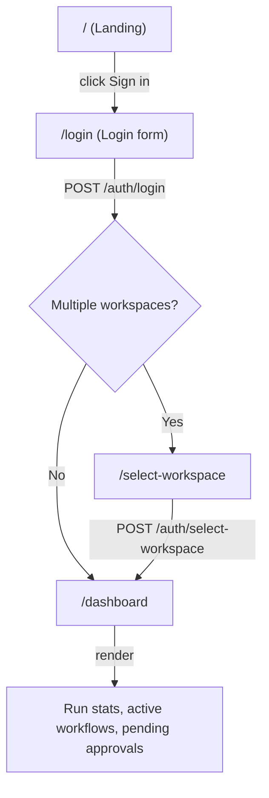
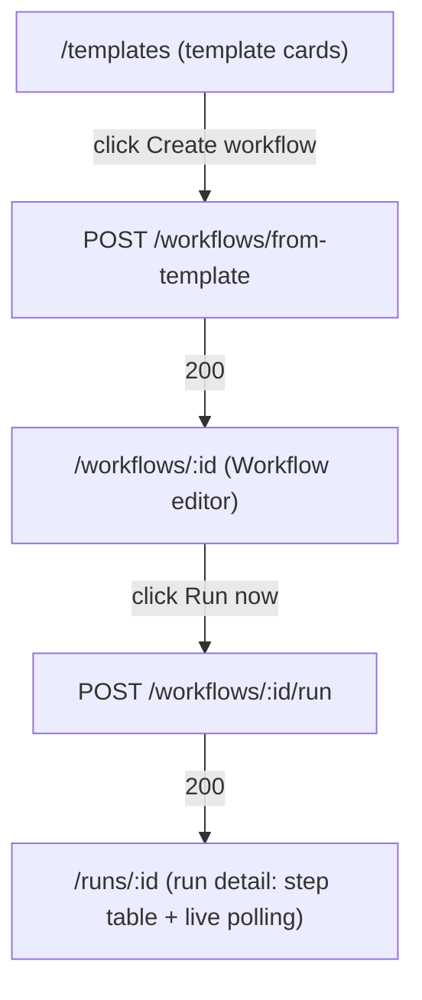
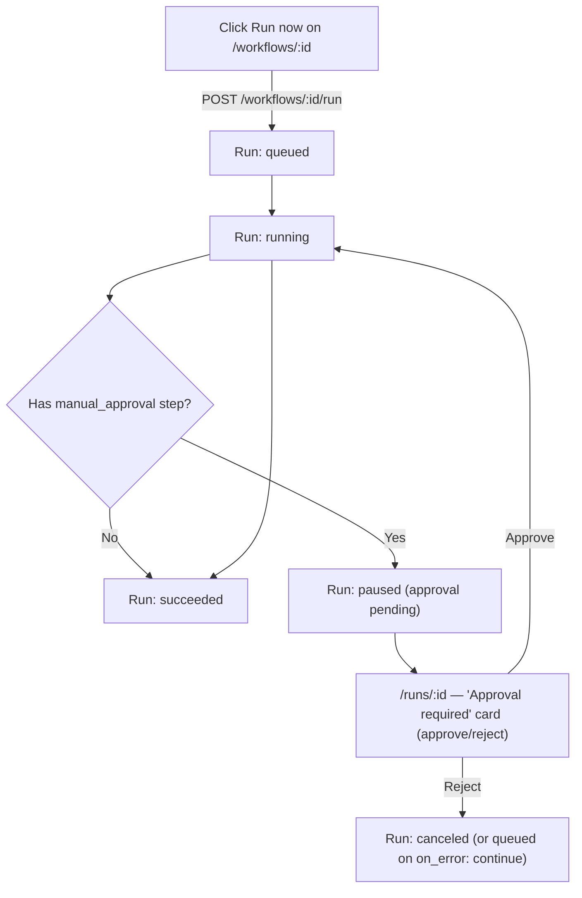
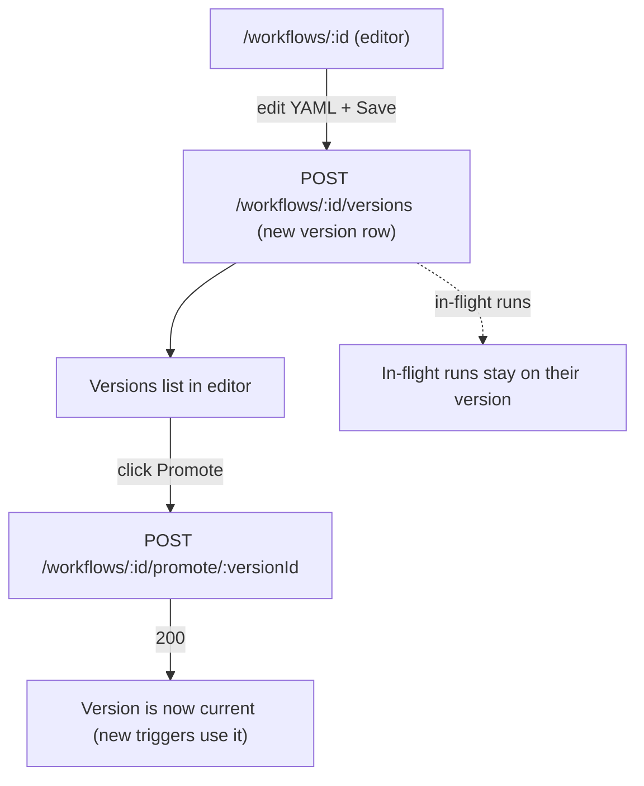

# FlowForge Open — UI Guide

The operator-facing surface is a **React 18 single-page application** built with Vite 6, Tailwind 4, and React Router. It is served as static assets by the Fastify API server (the SPA bundle is copied into `apps/server/dist/web` at build time and served as a catch-all for non-API routes).

Source: `apps/web/src/`.

---

## Pages and routes

All routes are defined in `apps/web/src/App.tsx`. Public routes (landing, login, register, workspace-select) render without the app chrome. Authenticated routes render inside the shared `Layout` (left nav + top bar).

| Route | Page component | Purpose |
|---|---|---|
| `/` | `Landing` | Marketing landing page. Links to sign in / create account. |
| `/login` | `Login` | Email + password sign-in. On success, auto-selects the workspace when the account has exactly one; otherwise routes to the picker. |
| `/register` | `Create account` | New user registration (creates the user's first workspace + a pre-workspace session). |
| `/select-workspace` | `SelectWorkspace` | Workspace picker; lists workspaces the user belongs to and offers create. |
| `/dashboard` | `Dashboard` | Run statistics (incl. pending-approval count), recent-run table, active workflows. |
| `/workflows` | `Workflows` | List of enabled workflows (cards with version, run count, trigger count). |
| `/workflows/new` | `WorkflowNew` | Create a workflow — paste a YAML manifest or start from a template. |
| `/workflows/:id` | `WorkflowEditor` | View the workflow, run now (jumps to the run detail page), toggle enabled, recent runs. |
| `/templates` | `Templates` | The five freelancer workflow templates as cards with a create action. |
| `/runs` | `Runs` | Run history with status filters. |
| `/runs/:id` | `RunDetail` | Single run: status, step table with outputs, cancel, and the **Approval required** card (approve/reject for `manual_approval`). Live updates poll every 1.5 s while active. |
| `/credentials` | `Credentials` | Credential vault: list names, add, remove. |
| `/audit` | `Audit` | Audit log table with chain-verification indicator. |
| `/settings` | `Settings` | Workspace + account overview cards and the member list (invites accept via `/invite`; invitations themselves have no separate management page in this build). |
| `/settings/approvals` | `SettingsApprovals` | Pending approval queue with approve/reject. |
| `/settings/webhooks` | `SettingsWebhooks` | Webhook signing-secret management. |
| `/settings/plan` | `SettingsPlan` | Usage meter, invoices, plan management. |
| `/settings/sso` | `SettingsSso` | OIDC provider management (Studio-gated by the server). |

## Key components (`apps/web/src/components/`)

- **`Layout.tsx`** — The authenticated shell: left navigation rail, top bar with workspace switcher and user menu, and the routed content area. All authenticated pages render inside it.
- **`CommandPalette.tsx`** — Keyboard-driven command palette for quick navigation between pages and actions.
- **`Toasts.tsx`** — Toast notification stack for success/error feedback after mutations.

## Primary user flows

### Sign-in → workspace → dashboard



### Create a workflow from a template



### Run a workflow and approve a waiting step



### Edit and version a workflow




## Loading, empty, error, and success states

The SPA communicates state through the shared `Toasts` component and inline rendering:

| State | How it appears |
|---|---|
| **Loading** | Pages fetch from `/api/v1` on mount; lists render a loading state until data arrives. The run detail page re-fetches the run/steps/approvals every 1.5 s while the run is active (queued/running/waiting/paused). |
| **Empty** | `Workflows` shows a "No workflows yet — create one from a template or author the YAML yourself" prompt when no enabled workflows exist. `Runs` shows "No runs yet." when the history is empty. |
| **Error** | API errors surface as toasts (red) with the error `code` and `message`. `401` clears the session and redirects to `/login`. `403 workspace_not_selected` redirects to `/select-workspace`. |
| **Success** | Mutations (create, run, approve, save) surface a green toast and navigate to the relevant page (e.g., create-from-template → editor, run-now → the run detail page). |

## API client (`apps/web/src/lib/api.ts`)

- Base path: `/api/v1` (relative — the SPA is served by the same origin as the API).
- `ApiError` carries `code` + `status` from the server envelope.
- CSRF: `setCsrfToken` / `clearCsrfToken` manage the token in `sessionStorage`; it is attached as `X-CSRF-Token` on every state-changing request.
- Session: the `ff_session` cookie is `httpOnly` so the JS never touches it — the browser sends it automatically.

## Local development

The SPA dev server (Vite) proxies `/api`, `/healthz`, `/readyz`, `/hooks`, `/mock-idp`, and `/demo` to the Fastify server at `http://localhost:3000` (the proxy target in `apps/web/vite.config.ts`) — start the API server on port 3000 for the proxy to match.

```bash
# Terminal 1 — API server on :3000 (needs Postgres + Redis)
npm run build
FF_DATABASE_URL=postgres://... FF_REDIS_URL=redis://... FF_PORT=3000 FF_SEED_DEMO=1 \
  node apps/server/dist/index.js

# Terminal 2 — Vite dev server with HMR
npm install
cd apps/web && npx vite
```

Open the Vite dev URL (default `http://localhost:5173`). API calls proxy to `:3000`; change the proxy target in `apps/web/vite.config.ts` if your API server listens elsewhere.

To produce the production bundle that the server serves:

```bash
npm run build
# → apps/web/dist/ (SPA) copied into apps/server/dist/web/
```

## Deployment path

The SPA has no independent deployment — it is built into the API server's static path by `npm run build` (the `scripts/copy-static-assets.js` step) and served as a catch-all. The Docker image builds and serves it in one binary. If the SPA bundle is missing, the server returns a fallback HTML page: *"Frontend not built. Run `npm run build`."*

## Design system

Styling is **Tailwind CSS 4** (via `@tailwindcss/vite`) on top of a closed CSS
token layer (`apps/web/src/styles/tokens.css` — the only place raw hex/px
values live; every component references `var(--...)` tokens). Fonts: Inter
(UI) + JetBrains Mono (code/manifest).

The full design system is specified in **`DESIGN.md`** (repo root, with a
product-soul brief in `SOUL.md`). Implemented palette: near-black charcoal
backgrounds on the slate scale with a single **warm amber accent — "the
forge"** (`--accent: #E09132`). This is a documented, deliberate divergence
from the product spec §10.1's indigo accent (DESIGN.md's "patterns we
deliberately diverge from").
